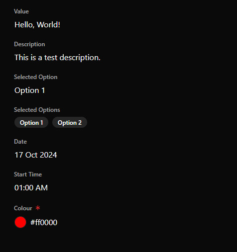
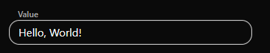
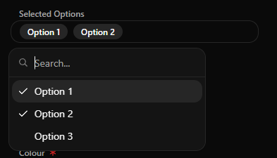
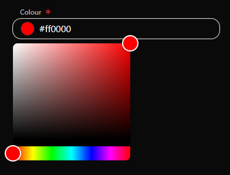

# shadcn-inline-edit

These inline-edit components display as regular text and transform into an input field when clicked. They also feature a pointer cursor and highlight colors on hover for better user interaction.

These aren't super robustly tested but have been working fine in my personal projects.



## How to use

In normal shadcn-ui style, copy the components into your project. Put them into a folder `@/components/inline` next to the `ui` folder.

- `inline-date-picker.tsx` has an additional dependency on `luxon`.
- `inline-colour-input.tsx` has an additional dependency on `react-colorful`.

### Example usage

Text input



```tsx
<InlineTextInput label="Value" initialValue={value} onSubmitted={(value) => submit({ value })} />
```

Text area

```tsx
<InlineTextArea
  label="Description"
  initialValue={description}
  onSubmitted={(description) => submit({ description })}
/>
```

Combobox

```tsx
<InlineCombobox
  label="Selected Option"
  initialValue={id}
  options={options.map((option) => ({
    key: option.id,
    label: option.name,
  }))}
  onSubmitted={(option) => submit({ option })}
/>
```

Multi-select combobox



```tsx
<InlineMultiSelectCombobox
  label="Selected Options"
  initialValue={selectedOptions.map((option) => option.id)}
  options={options.map((option) => ({
    key: option.id,
    label: option.name,
  }))}
  onSubmitted={(optionIds) =>
    submit({
      optionIds,
    })
  }
/>
```

Date picker

```tsx
<InlineDatePicker label="Date" initialValue={new Date()} onSubmitted={(date) => submit({ date })} />
```

Time picker

```tsx
<InlineTimeInput
  label="Start Time"
  initialValue={'01:00 AM'}
  onSubmitted={(startTime) => submit({ startTime })}
/>
```

Colour picker



```tsx
<InlineColourInput
  label="Colour"
  initialValue={colour}
  onSubmitted={(colour) => submit({ colour })}
/>
```

## Contributions

Contributions are welcome. Please submit PRs for any improvements or extra components.

## License

MIT License

Copyright (c) 2024 Caleb Faith

Permission is hereby granted, free of charge, to any person obtaining a copy
of this software and associated documentation files (the "Software"), to deal
in the Software without restriction, including without limitation the rights
to use, copy, modify, merge, publish, distribute, sublicense, and/or sell
copies of the Software, and to permit persons to whom the Software is
furnished to do so, subject to the following conditions:

The above copyright notice and this permission notice shall be included in all
copies or substantial portions of the Software.

THE SOFTWARE IS PROVIDED "AS IS", WITHOUT WARRANTY OF ANY KIND, EXPRESS OR
IMPLIED, INCLUDING BUT NOT LIMITED TO THE WARRANTIES OF MERCHANTABILITY,
FITNESS FOR A PARTICULAR PURPOSE AND NONINFRINGEMENT. IN NO EVENT SHALL THE
AUTHORS OR COPYRIGHT HOLDERS BE LIABLE FOR ANY CLAIM, DAMAGES OR OTHER
LIABILITY, WHETHER IN AN ACTION OF CONTRACT, TORT OR OTHERWISE, ARISING FROM,
OUT OF OR IN CONNECTION WITH THE SOFTWARE OR THE USE OR OTHER DEALINGS IN THE
SOFTWARE.
